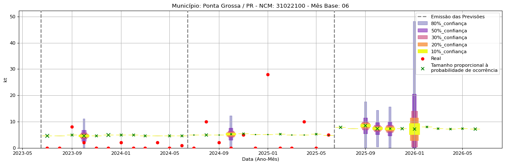
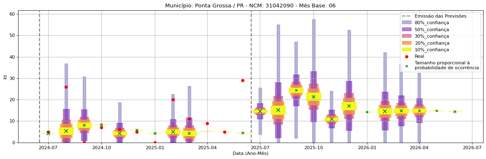
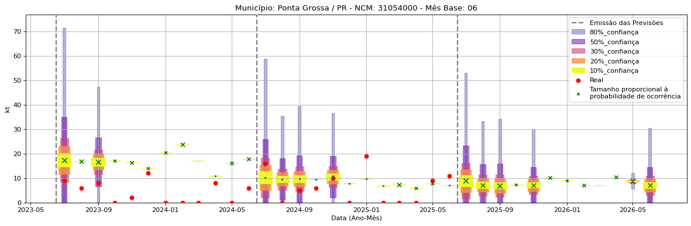

<header>
    <h1><a href="https://quantimportbrazil.github.io/Sobre/">QuantImport</a></h1>
</header>

---

# Previsão de Importação - Ponta Grossa-PR

> **Emissão:** 06-2025
> Para fins de comparação, também apresentamos a seguir previsões e valores reais de períodos anteriores ao atual.
> As previsões foram geradas com base em dados limitados até o mês 6.

---

**[Home](https://quantimportbrazil.github.io/Sobre/)** | **[Selecionar Estado (UF)](https://quantimportbrazil.github.io/Unidades_Federativas/)**

Fator de Influência em Destaque nos últimos 8 anos:

Previsão Influenciada:
- Município: Ponta Grossa
- Produto (NCM): Sulfato de amônio-31022100 
- Mês previsto: 08

        Fator Influenciador: Comércio Exterior
        - Produto Sementes e frutos oleaginosos; grãos, sementes e frutos diversos; plantas industriais ou medicinais; palhas e forragens (12)
        - UF SP
        - Unidade sm_diff
\n

Fator de Influência em Destaque nos últimos 8 anos:

Previsão Influenciada:
- Município: Ponta Grossa
- Produto (NCM): Outros cloretos de potássio-31042090 
- Mês previsto: 01

        Fator Influenciador: Comércio Exterior
        - Produto Adubos (fertilizantes) (31)
        - UF RJ
        - Unidade kt_lag13
\n

Fator de Influência em Destaque nos últimos 8 anos:

Previsão Influenciada:
- Município: Ponta Grossa
- Produto (NCM): Diidrogeno-ortofosfato de amônio (fosfato monoamônico ou monoamoniacal), mesmo misturado com hidrogeno-ortofosfato de diamônio (fosfato diamônico ou diamoniacal)-31054000 
- Mês previsto: 08

        Fator Influenciador: Comércio Exterior
        - Produto Sementes e frutos oleaginosos; grãos, sementes e frutos diversos; plantas industriais ou medicinais; palhas e forragens (12)
        - UF MA
        - Unidade sm_diff
\n

